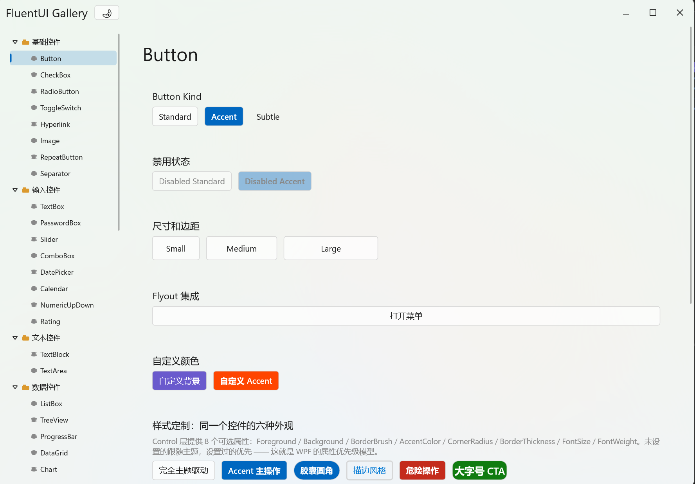
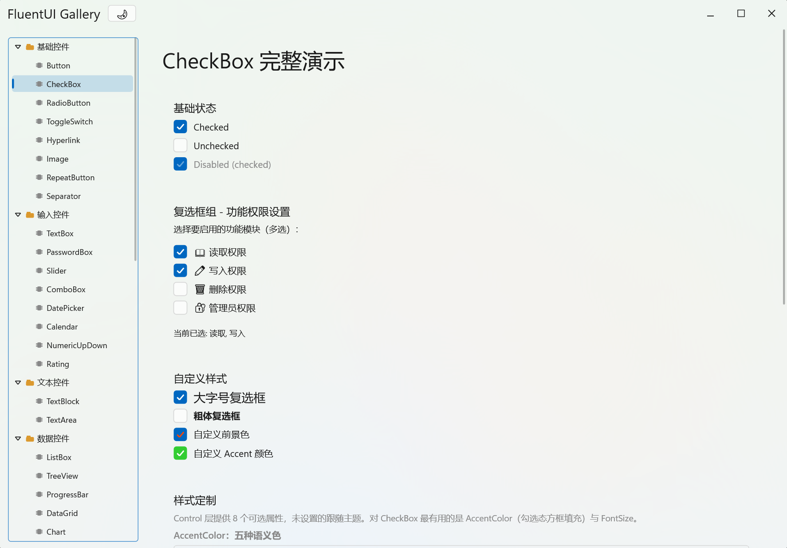
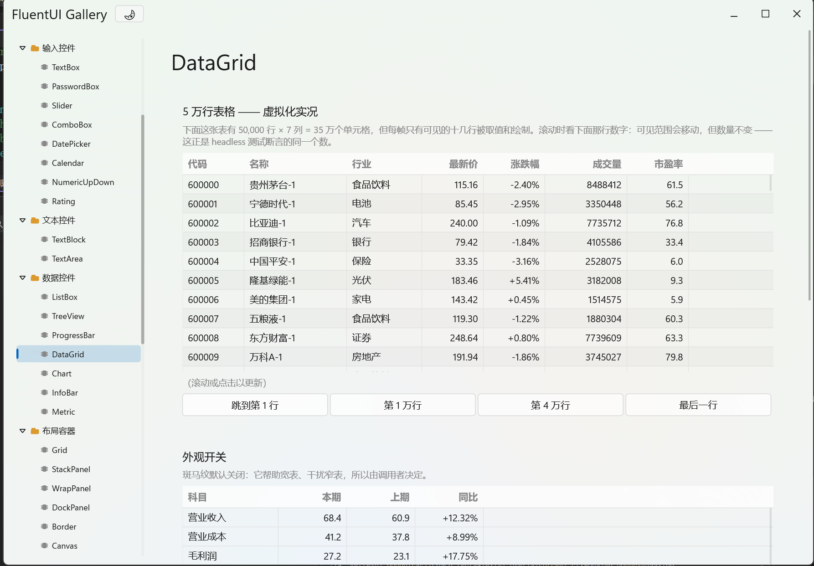
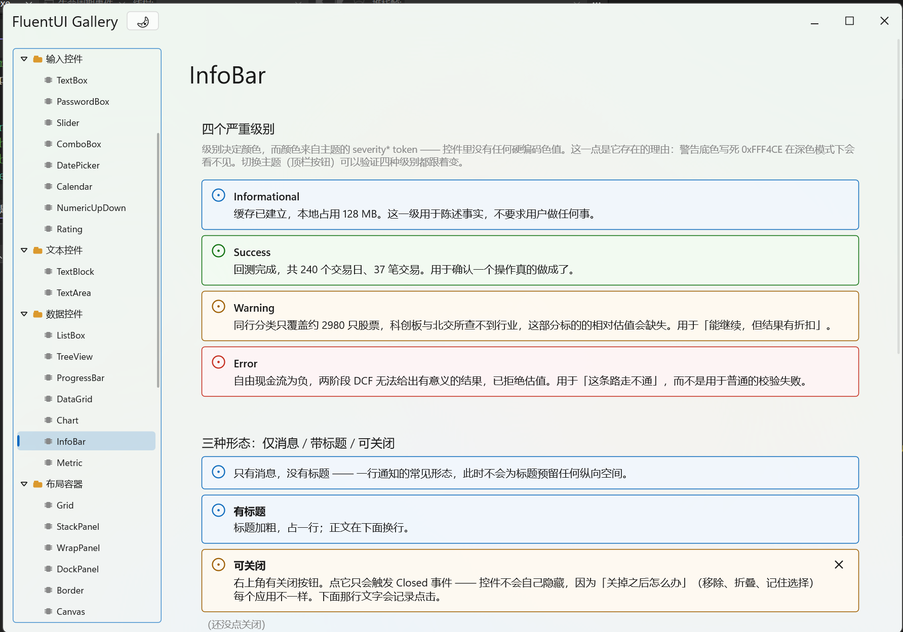

# FluentUI

一个从零手写的 Windows 桌面 UI 框架 —— 不依赖 WinUI / XAML / WinRT，
基于 Win32 + Direct2D + DirectWrite + DirectComposition，全部 C++20。

元素模型、布局、输入路由、主题系统、合成器集成均为手写实现。
API 刻意对齐 WPF/WinUI 的心智模型（Measure/Arrange、DirtyFlags、路由事件、
token 化主题），有 XAML 经验即可平移。

## 截图

<div align="center">
  
  <p><em>Button - 多种样式、状态和自定义外观</em></p>
</div>

<div align="center">
  
  <p><em>CheckBox - 基础状态、复选框组、自定义样式</em></p>
</div>

<div align="center">
  
  <p><em>DataGrid - 5 万行虚拟化表格，只渲染可见行</em></p>
</div>

<div align="center">
  
  <p><em>InfoBar - 四个严重级别，可配置标题和关闭按钮</em></p>
</div>

## 特性

- **retained-mode 元素树**：Visual → UIElement → FrameworkElement → Control/Panel
  四层，每层只加一个关注点
- **WPF 式两趟布局**：Measure/Arrange，带 Measure 缓存短路
- **DirectComposition 渲染**：窗口内容绘制在 DComp virtual surface 上，
  滚动与属性动画跑在合成器线程，UI 线程繁忙也不卡
- **文本虚拟化**：TextArea 的 NoWrap 模式精确虚拟化（28 MB / 20 万行秒开），
  Wrap 模式按段估算虚拟化；高吞吐 log 追加（AppendText O(1)，SetMaxLines 环形上限）
- **主题 token 化**：亮/暗双主题，控件零硬编码颜色
- **每窗口 DPI**：PerMonitorV2，跨屏拖动实时切换
- **idle 零 CPU**：无轮询定时器，消息循环无事时 INFINITE 阻塞

## 控件

基础：Button / CheckBox / RadioButton / ToggleSwitch / Slider / ProgressBar /
TextBlock / TextBox / Hyperlink / Image

选择与导航：ComboBox（可编辑）/ ListBox（可选虚拟化，O(visible) 绘制）/
TreeView（固定行高虚拟化 + DComp 合成器滚动）/ TabControl / MenuBar / MenuFlyout /
ToolBar（CommandBar 风格，溢出进 flyout）/ StatusBar

文本与日期：TextArea（NoWrap/Wrap 两模式均虚拟化 + DComp 合成器滚动）/
DatePicker / Calendar

对话框：ContentDialog / MessageDialog

布局：StackPanel / Grid / DockPanel / Canvas / WrapPanel / Border / ScrollPanel（通用可滚动容器，不虚拟化）/ GridSplitter（可拖动分隔条）

另有两个内部零件：`layout/ScrollViewer.h` 是滚动条引擎（滚动状态、thumb 几何、
平滑滚动动画、自动淡出/悬停展开），被 ListBox/TreeView/TextArea/ScrollPanel
内嵌复用；`composition/ScrollContentHost.h` 是合成器滚动宿主，被 TextArea/TreeView
内嵌复用。

## 构建

需要 Visual Studio 2022+、Windows 10 1803+ SDK。仅 x64。

### Visual Studio 方式

```powershell
# 打开解决方案
.\Fluent.slnx

# 或命令行编译
MSBuild Fluent.slnx -p:Configuration=Debug -p:Platform=x64
```

### CMake 方式

```bash
# 配置
cmake -B build -G Ninja -DCMAKE_BUILD_TYPE=Debug

# 编译
cmake --build build

# 运行演示
./build/FluentUIDemo.exe
```

## 运行演示

编译后运行 `FluentUIDemo.exe`，可以看到各控件的交互演示和代码示例。

## 测试

```bash
# Visual Studio 编译后
./x64/Debug/FluentUITests.exe

# CMake 编译后
./build/FluentUITests.exe
```

当前测试覆盖率：1611 个测试全部通过。

## 架构

```
FluentUI/
├── core/           # 元素树基类、属性系统、事件路由
├── layout/         # 两趟布局引擎、Panel 基类、7 种布局容器
├── controls/       # 27 种控件实现
├── composition/    # DirectComposition 集成、合成器滚动
├── text/           # DirectWrite 文本布局、虚拟化引擎
├── window/         # Win32 窗口、消息循环、输入路由
└── theme/          # 主题令牌、资源字典、亮暗模式切换
```

## 许可证

MIT License - 详见 [LICENSE](LICENSE)

## 贡献

欢迎提交 Issue 和 Pull Request。请确保：
- 代码遵循现有风格（`.editorconfig` 已配置）
- 新功能附带测试
- 大改动请先开 Issue 讨论

## 路线图

- [ ] 更多控件：TreeView 编辑、富文本编辑器
- [ ] 性能优化：增量布局、渲染裁剪
- [ ] 动画系统：声明式动画 API
- [ ] 可访问性：UI Automation 支持

---

**状态**: 个人项目，功能持续完善中。API 可能变动。
